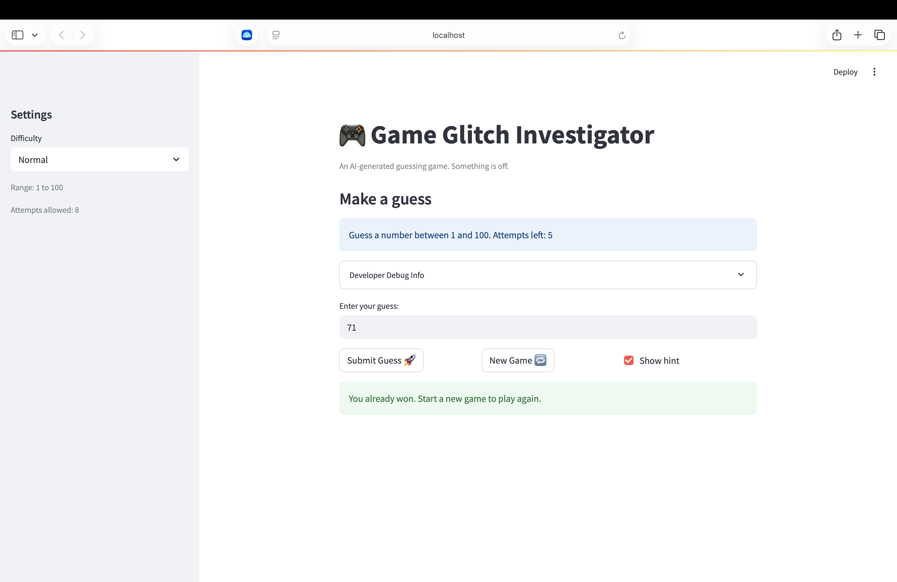

# 🎮 Game Glitch Investigator: The Impossible Guesser

## 🚨 The Situation

You asked an AI to build a simple "Number Guessing Game" using Streamlit.
It wrote the code, ran away, and now the game is unplayable. 

- You can't win.
- The hints lie to you.
- The secret number seems to have commitment issues.

## 🛠️ Setup

1. Install dependencies: `pip install -r requirements.txt`
2. Run the broken app: `python -m streamlit run app.py`

## 🕵️‍♂️ Your Mission

1. **Play the game.** Open the "Developer Debug Info" tab in the app to see the secret number. Try to win.
2. **Find the State Bug.** Why does the secret number change every time you click "Submit"? Ask ChatGPT: *"How do I keep a variable from resetting in Streamlit when I click a button?"*
3. **Fix the Logic.** The hints ("Higher/Lower") are wrong. Fix them.
4. **Refactor & Test.** - Move the logic into `logic_utils.py`.
   - Run `pytest` in your terminal.
   - Keep fixing until all tests pass!

## 📝 Document Your Experience

- [ ] Describe the game's purpose.
The game is a "High-Low" guessing game where the player tries to guess a hidden secret number within a limited number of attempts.
- [ ] Detail which bugs you found.
1. The hint messages were reversed (the game told the player to go "HIGHER" when their guess was too high, and "LOWER" when it was too low).
2. The attempt counter initialization bug caused the starting attempts to calculate incorrectly.
- [ ] Explain what fixes you applied.
* Fixed the logic inside `check_guess` within `logic_utils.py` to return "Too High" and "Too Low" correctly based on the user's input.
* Corrected the initialization variable in `app.py` so the game accurately tracks the first attempt.


## 📸 Demo Walkthrough

Describe your fixed game in numbered steps so a reader can follow along without watching a video:

1. User enters a guess of 50
2. Game returns "Too Low" and updates the remaining attempts
3. User enters a guess of 75
4. Game returns "Too High" and updates the remaining attempts
5. Winning Path: User enters the correct guess (e.g., 61), the game ends by displaying a "You won" message. 
6. Losing Path: User runs out of remaining attempts without guessing the number, the game displays a "Game Over" message.

**Screenshot** *(optional)*: 

## 🧪 Test Results

```
# Paste your pytest output here, e.g.:
# pytest tests/
# ========================= X passed in 0.XXs =========================
```

## 🚀 Stretch Features

Challenge 1

============================= test session starts ==============================
platform darwin -- Python 3.13.5, pytest-8.3.4, pluggy-1.5.0
rootdir: /Users/amanuel/CodePath/CodePath AI110/ai110-module1show-gameglitchinvestigator-starter
plugins: anyio-4.7.0
collected 8 items

tests/test_game_logic.py ........                                         [100%]

============================== 8 passed in 0.01s ===============================


- [ ] [If you choose to complete Challenge 4, describe the Enhanced UI changes here — a screenshot is optional]
